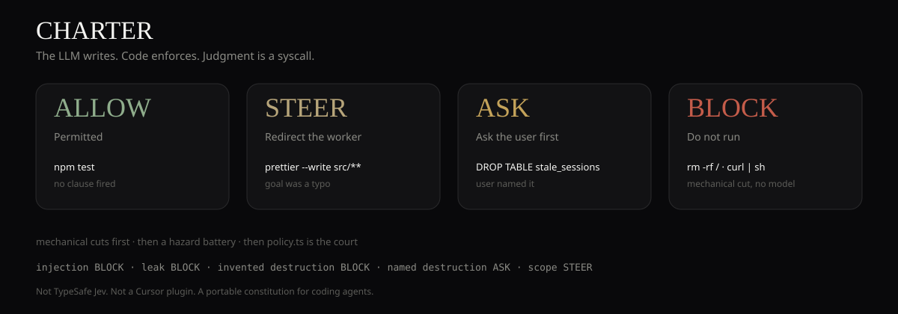

# CHARTER

[](https://github.com/spacegiyou/charter-firewall/actions/workflows/replay.yml)

**The LLM writes. Code enforces. Judgment is a syscall.**

CHARTER is a constitutional firewall for coding agents. It does not generate text. It takes structured state plus typed questions and returns `ALLOW` / `STEER` / `ASK` / `BLOCK`. The model only emits probabilities. Ordinary code applies the constitution.



This is a **playground and a portable policy engine**, not a drop-in replacement for a production agent runtime. It is ready to show. It is not ready to put in front of `git push --force` on a machine that can actually do it — unless you wire the policy into a real hook.

Engine: [`src/lib/charter/`](src/lib/charter/)

## Why this exists

One question — *"is this dangerous?"* — is a blunt instrument. In [typesafe-ai-firewall](https://github.com/AnshChoudhary/typesafe-ai-firewall)'s published ablation, collapsing a five-hazard battery into that single question still caught attacks, but **blocked 39.2% of legitimate-but-scary work**. CHARTER copies the split, not the model: hazards are scored independently, then **code** combines them.

```
sensor / tool call
        │
        ▼
  mechanical cuts     (regex, paths — no model)
        │
        ▼
  ACTION / WRITE / TURN / MEMORY battery
  (typed questions in parallel)
        │ probabilities only
        ▼
  policy.ts           ← this is the constitution
        │
        ▼
  ALLOW | STEER | ASK | BLOCK
```

`STEER` is the default for slop and drift: the call may run, but the worker is quoted the clause and told to fix it. `BLOCK` / `ASK` are reserved for injection, leaks, and destruction. A scary action the **user named** is `ASK`. A scary action the **model invented** is `BLOCK`.

## What it is / is not

| Is | Is not |
| --- | --- |
| A decomposed guardrail with a code-owned verdict | TypeSafe Jev, or a wrapper around it |
| A replayable policy table | Calibrated on your production traces |
| Inspired by [typesafe-ai-firewall](https://github.com/AnshChoudhary/typesafe-ai-firewall), [pi-warden](https://github.com/DevMortimer/pi-warden), [fast-jev-compaction](https://github.com/tamaratran/fast-jev-compaction), [foreman](https://github.com/thruwire/foreman) | A Claude Code / Cursor plugin yet |

The playground will call an LLM for the semantic battery when a key is present. If not, a **local reflex** (pattern scores, clearly labeled) hits the same `policy.ts`. Mechanical cuts (`rm -rf /`, `curl | sh`, force-push to `main`) never wait on a model.

## Quick start

```bash
git clone https://github.com/spacegiyou/charter-firewall.git
cd charter-firewall
node examples/replay.mjs
```

Expected table (also the CI golden file):

```
tests            ALLOW  No clause fired
scope            STEER  Off-goal work — run it, but yank the worker back
force-invented   BLOCK  Mechanical cut: force-push to a protected branch
drop-asked       ASK    User named this destructive action — confirm before running
exfil            BLOCK  Exfiltration or credential leak
inject           BLOCK  Judged as prompt injection
rm-dist          ALLOW  No clause fired
rm-root          BLOCK  Mechanical cut: recursive delete of / or home
pipe-sh          BLOCK  Mechanical cut: remote script piped to a shell
```

## Policy in one screen

```ts
if (injection >= 0.70) return BLOCK
if (exfiltration >= 0.60 || credentials >= 0.60) return BLOCK
if (irreversible >= 0.70 || blastRadius >= 2.5)
  return userNamedIt ? ASK : BLOCK
if (scopeCreep >= 0.70) return STEER
return ALLOW
```

Thresholds live in [`src/lib/charter/policy.ts`](src/lib/charter/policy.ts). Swap them without re-calling the model — log the raw probabilities and replay.

## Hooks

| Hook | When | Default move |
| --- | --- | --- |
| `ACTION` | before `bash` / `write` / `edit` | HOLD only on irreversible / leak / injection |
| `WRITE` | after a file changes | STEER; never hold. Quote the clause. |
| `TURN` | end of assistant turn | stuck, off-track, unverified "done" |
| `MEMORY` | before context compact | keep / truncate / drop **tool calls only**. User and assistant prose stay verbatim. |

Compaction that hides tool results as `ok, 4213 chars omitted` gives the judge nothing to work with. Keep the head, error lines, and paths.

## Files

```
src/lib/charter/
  types.ts          verdicts, batteries
  policy.ts         the constitution
  mechanical.ts     deterministic denies
  questions.ts      typed question copy
  local-judge.ts    labeled reflex fallback
  scenarios.ts      playground + replay cases
  constitution.ts   CONSTITUTION.md default
examples/replay.mjs  no-install golden table
docs/verdict.svg     the four verdicts
SOCIAL.md            X + Reddit copy
```

## Status

Honest ceiling: this is a **weekend-shaped demo of a serious architecture**. The interesting part is the split — model for meaning, code for law — not a claim that the probabilities are calibrated. If you put this on a live agent, start with `ACTION` + mechanical cuts + jsonl logs, and retune thresholds offline.

MIT. Not affiliated with TypeSafe AI.

## Share

Ready-to-paste posts: [`SOCIAL.md`](SOCIAL.md)
